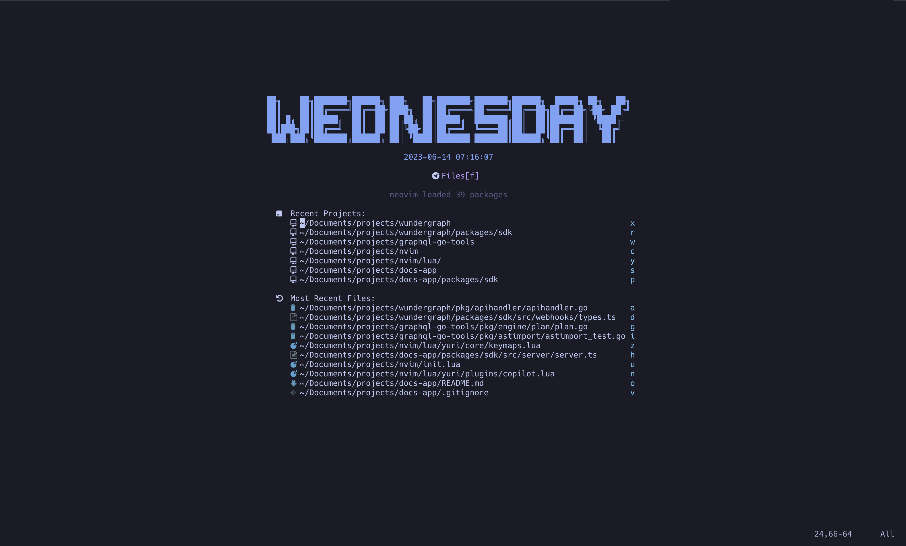
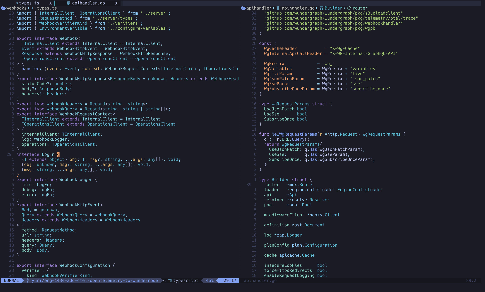

# My neovim configuration

Important: WIP, please do not use it blindly.

## Requirements

True color terminal, e.g. [iTerm2](https://iterm2.com/)

## Setup

```bash
brew install neovim
brew install ripgrep
```

I highly reommend to install `ripgrep` for `fzf` to work properly.
`ripgrep` respects `.gitignore` rules and automatically ignores hidden files/directories.

Create a config directory:

```bash
mkdir -p ~/.config/nvim
```

Copy the `lua` and `init.lua` to the config directory:

```bash
cp -r lua ~/.config/nvim
cp init.lua ~/.config/nvim
```

Download and install a [Nerd Font](https://www.nerdfonts.com/)
Alternativly you can use [this installer](https://github.com/ronniedroid/getnf)

Download copilot pack:

```bash
git clone https://github.com/github/copilot.vim.git \
  ~/.config/nvim/pack/github/start/copilot.vim
```

## Appearance





## Plugins

Core:

- [packer plugin manager](https://github.com/wbthomason/packer.nvim)
- [tokyonight theme](https://github.com/folke/tokyonight.nvim)
- [tmux navigator](https://github.com/christoomey/vim-tmux-navigator)
- [vim maximizer](https://github.com/szw/vim-maximizer)
- [surroundings](https://github.com/tpope/vim-surround)
- [replace with register](https://github.com/inkarkat/vim-ReplaceWithRegister)
- [comments](https://github.com/numToStr/Comment.nvim)
- [file explorer](https://github.com/nvim-tree/nvim-tree.lua)
- [dev icons](https://github.com/nvim-tree/nvim-web-devicons)
- [status line](https://github.com/nvim-lualine/lualine.nvim)
- [git](https://github.com/lewis6991/gitsigns.nvim)
- [undo tree](https://github.com/mbbill/undotree)
- [tabs](https://github.com/romgrk/barbar.nvim)
- [dashboard](https://github.com/nvimdev/dashboard-nvim)

Telecope:

- [telescope fzf](https://github.com/nvim-telescope/telescope-fzf-native.nvim)
- [telescope](https://github.com/nvim-telescope/telescope.nvim)
- [telescope ui select for lsp](https://github.com/nvim-telescope/telescope-ui-select.nvim)

Completition:

- [nvim-cmp completition engine](https://github.com/hrsh7th/nvim-cmp)
- [cmp-buffer source](https://github.com/hrsh7th/cmp-buffer)
- [cmp-path](https://github.com/hrsh7th/cmp-path)

Snippets:

- [luasnip snippet engine](https://github.com/L3MON4D3/LuaSnip)
- [completition for snippets](https://github.com/saadparwaiz1/cmp_luasnip)
- [friendly snippets](https://github.com/rafamadriz/friendly-snippets)

LSP:

- [mason](https://github.com/williamboman/mason.nvim)
- [mason lsp config](https://github.com/williamboman/mason-lspconfig.nvim)
- [lsp config](https://github.com/williamboman/mason-lspconfig.nvim)
- [lsp completition](https://github.com/hrsh7th/cmp-nvim-lsp)
- [lspsaga](https://github.com/nvimdev/lspsaga.nvim)
- [TS lsp](https://github.com/jose-elias-alvarez/typescript.nvim)
- [lsp kind](https://github.com/onsails/lspkind.nvim)
- [inc rename](https://github.com/smjonas/inc-rename.nvim)
- [treesitter](https://github.com/nvim-treesitter/nvim-treesitter)

Formatting & Linting:

- [null-ls](https://github.com/jose-elias-alvarez/null-ls.nvim)
- [mason null-ls](https://github.com/jay-babu/mason-null-ls.nvim)
- [autopairs](https://github.com/windwp/nvim-autopairs)
- [autotag](https://github.com/windwp/nvim-ts-autotag)

Debugging:

- [nvim dap](https://github.com/mfussenegger/nvim-dap)
